<picture>
  <source media="(max-width: 600px) and (prefers-color-scheme: light)" srcset="./assets/generated/galaxy-header-mobile-light.svg">
  <source media="(max-width: 600px)" srcset="./assets/generated/galaxy-header-mobile.svg">
  <source media="(prefers-color-scheme: light)" srcset="./assets/generated/galaxy-header-light.svg">
  
</picture>

  <a href="https://servrox.solutions/">Website ↗</a> &nbsp; · &nbsp;
  <a href="https://console-fx.vercel.app/studio/">ConsoleFX studio</a> &nbsp; · &nbsp;
  <a href="https://github.com/stark-ai-de">STARK AI</a>

### Building across the stack

I’m a full-stack developer based in **Stuttgart, Germany**. I build web and hybrid mobile apps, open-source libraries, and tools that make development a little more expressive.

**TypeScript** is the common thread: Angular and Ionic, React and Next.js, Node.js and NestJS. My public work also spans **Web3** and **AI coding workflows**.

### Selected work

<picture>
  <source media="(max-width: 600px) and (prefers-color-scheme: light)" srcset="./assets/generated/projects-constellation-mobile-light.svg">
  <source media="(max-width: 600px)" srcset="./assets/generated/projects-constellation-mobile.svg">
  <source media="(prefers-color-scheme: light)" srcset="./assets/generated/projects-constellation-light.svg">
  
</picture>

| Project | What I’m building |
| --- | --- |
| **[ConsoleFX](https://github.com/servrox/console-fx)** | A TypeScript library and [visual studio](https://console-fx.vercel.app/studio/) for expressive browser-console messages. |
| **[1337 Turbo Starter](https://github.com/servrox/1337-turbo-starter)** | A full-stack Web3 monorepo with shared tooling, Aptos, and an IOTA wallet experience. |
| **[Agent Skills](https://github.com/stark-ai-de/agent-skills)** | Open-source skills and engineering workflows for Codex, Claude Code, and Cursor. |

### My toolkit

<picture>
  <source media="(max-width: 600px) and (prefers-color-scheme: light)" srcset="./assets/generated/tech-stack-mobile-light.svg">
  <source media="(max-width: 600px)" srcset="./assets/generated/tech-stack-mobile.svg">
  <source media="(prefers-color-scheme: light)" srcset="./assets/generated/tech-stack-light.svg">
  
</picture>

  
<b>Open-source activity</b> — a year in contributions

   
  <picture>
    <source media="(max-width: 600px) and (prefers-color-scheme: light)" srcset="./assets/generated/stats-card-mobile-light.svg">
    <source media="(max-width: 600px)" srcset="./assets/generated/stats-card-mobile.svg">
    <source media="(prefers-color-scheme: light)" srcset="./assets/generated/stats-card-light.svg">
    
  </picture>

 

Each star represents a public repository; its glow reflects its stargazers. Built with <a href="https://github.com/vinimlo/galaxy-profile">Galaxy Profile</a>, with custom colors and focus areas. The sky refreshes twice a day.
